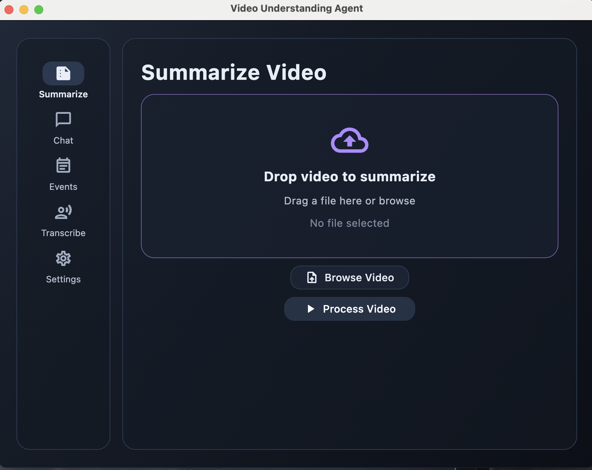

# Video Agent UI (Current Architecture)
Date: 2025-12-24

This document describes the current UI architecture and runtime behavior as implemented in the Flet app.

## Overview
The UI is a desktop-first Flet app with a dark, glass-like theme. It is organized into a root `AppLayout` with a left navigation rail and a main content panel that swaps views based on the selected tab. Long-running agent calls are executed in background threads to keep the UI responsive.

Screenshot:


## File Map
```
src/video_agent/ui/
├── app.py              # App entry point, background layers, rebuild hook
├── layout.py           # AppLayout navigation and view switching
├── theme.py            # Shared palette + accent presets
├── agent_helper.py     # Async bridge to VideoAgent
└── views/
    ├── summarize.py    # Summarize view
    ├── chat.py         # Chat/Q&A view
    ├── events.py       # Event detection view
    ├── transcribe.py   # Transcription view
    └── settings.py     # Model + accent settings
```

## Entry Point (`src/video_agent/ui/app.py`)
- Sets page title, theme mode, and background color.
- Builds a `Stack` with a base gradient and a glow overlay.
- Mounts `AppLayout` inside a padded container.
- Exposes `page.rebuild_app()` so the UI can be rebuilt when the accent changes.

## Layout & Navigation (`src/video_agent/ui/layout.py`)
- `AppLayout` extends `ft.Row` and holds:
  - A left `NavigationRail` wrapped in a styled container.
  - A main `view_container` panel where the active view is rendered.
- The selected tab index is stored so the app can rebuild without losing context.
- `on_nav_change` swaps the view and updates the page.

## Theme System (`src/video_agent/ui/theme.py`)
- All colors and gradients are defined in one module.
- Accent presets define `ACCENT`, `BUTTON_PRIMARY_BG`, and `DROP_BORDER`.
- `apply_accent()` updates the active accent values at runtime.
- Settings uses `apply_accent()` and triggers `page.rebuild_app()` to refresh controls.

## Views (Summarize, Chat, Events, Transcribe)
Each view is a `ft.Column` with a common flow:
- Upload area (click-to-browse) + secondary "Browse Video" button.
- Primary action button to run the agent task.
- Progress bar + status text for feedback.
- Results area with `ft.Markdown` and a Save button.

### File Picker Handling
- Uses `ft.FilePicker` for web and most desktop platforms.
- On macOS desktop, falls back to `osascript` dialogs for open/save.
  - This avoids native file dialog issues seen with Flet on macOS.

### Save Handling
- Save uses either `FilePicker.save_file()` or the macOS native dialog.
- Writes results to disk and updates the status line + snack bar.

## Agent Integration (`src/video_agent/ui/agent_helper.py`)
- `analyze_video()` runs work in `asyncio.to_thread`.
- Uploads video, runs the selected task, and returns:
  - `response.text`
  - token usage stats
  - elapsed time

## Runtime Rebuild for Accent Changes
- `SettingsView` calls `theme.apply_accent()` and triggers `page.rebuild_app()`.
- `AppLayout` is re-instantiated with the previously selected tab index.
- This ensures updated colors propagate to new controls.

## Current Limitations
- No native drag-and-drop yet (click-to-browse only).
- Accent choice is not persisted to disk (runtime only).
- Theme rebuild is a full view refresh (not a live style mutation).
